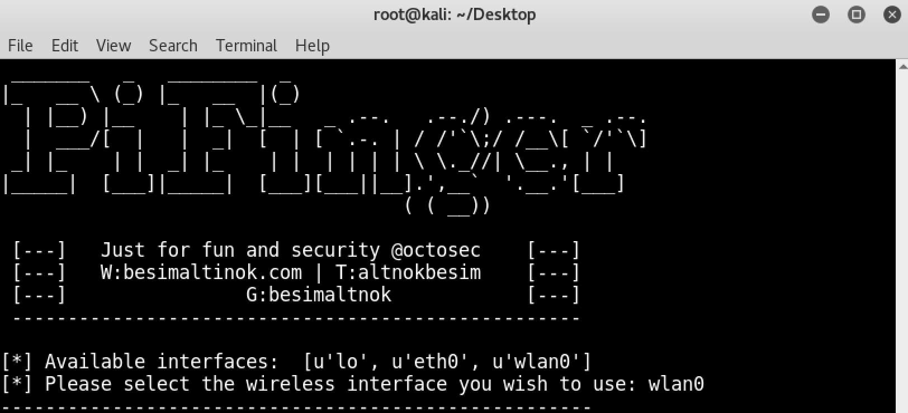
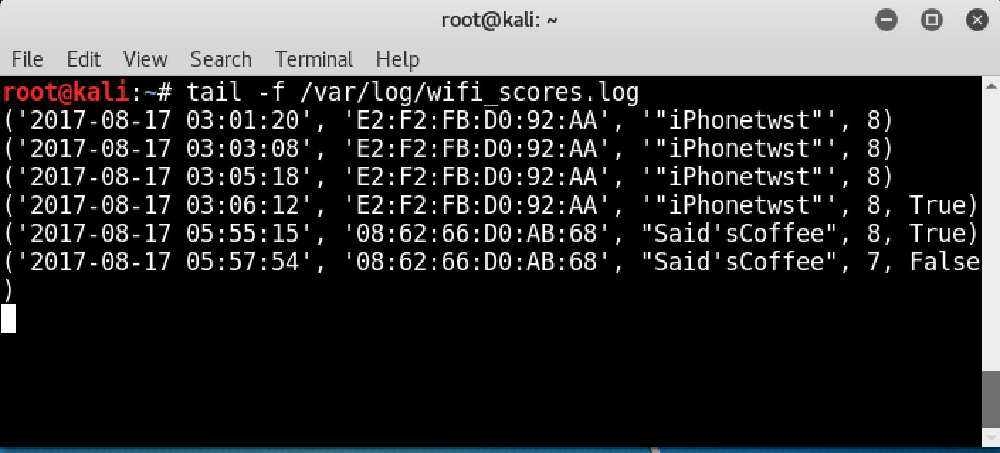
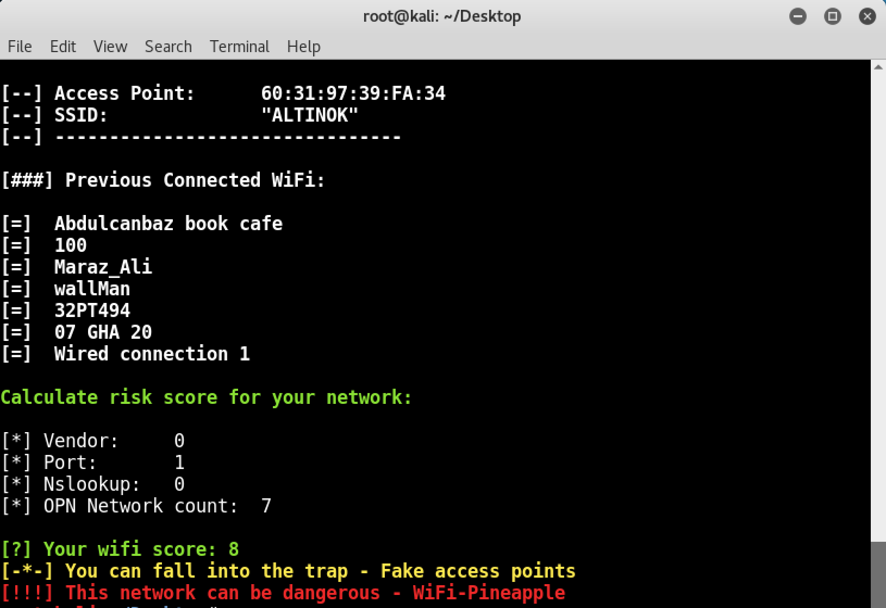
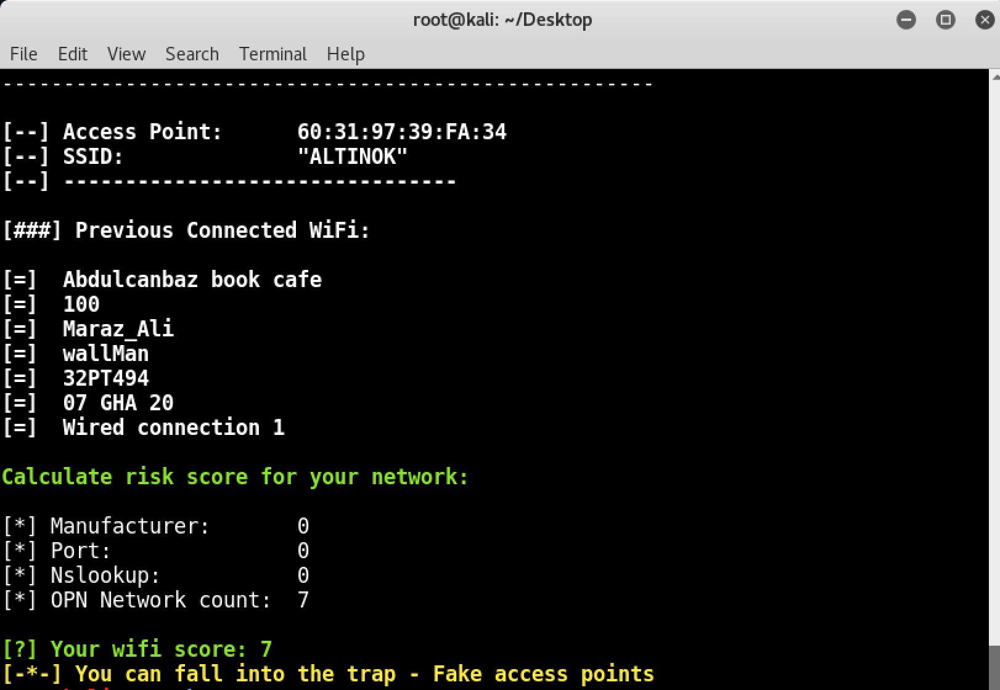

```

                        _______   _   ________  _                                  
                        |_   __ \ (_) |_   __  |(_)                                 
                          | |__) |__    | |_ \_|__   _ .--.   .--./) .---.  _ .--.  
                          |  ___/[  |   |  _|  [  | [ `.-. | / /'`\;/ /__\[ `/'`\] 
                         _| |_    | |  _| |_    | |  | | | | \ \._//| \__., | |     
                        |_____|  [___]|_____|  [___][___||__].',__`  '.__.'[___]    
                                                            ( ( __))    

                         [---]   Just for fun and security @octosec    [---]
                         [---]   W:besimaltinok.com | T:altnokbesim    [---]
                         [---]                G:besimaltnok            [---]
                         ---------------------------------------------------

```

### About Project

The purpose of this project is to determine whether the network we are connected for is opened by Wifi- Pineapple. In addition, the tool analyzes the wireless networks you have previously connected and gives you a security score.

### Features

* Is this network opened by pineapple?
* Have we been connected to insecure networks before?
* Logging  (
 `Wireless Security Score`)
(time, mac, ssid, score, is_pineapple)

### Used Techinuques

**WiFi-Pineapple Network Detection Techniques**

```
A Chinese proverb says:
"If attackers are accessing systems using default settings, 
we too can catch them with the default settings in their software and hardware."
```

* Manufacturer's MAC address information
* Default HTTP Port (1471)
* Default hostname information for wifi-pineapple

**Previous networks**

* Analyzes the wireless networks you have previously connected

### Features to add

* Windows version
* Full automatic analysis

### Usage (for Linux)

#### Requirements

* **Modules:** time, termcolor, sys, commands, interfaces, os
* **OS:** Kali, Ubuntu (Kali was also tested)
* **Python Version:** 2.x

Download pifinger:

`git clone https://github.com/besimaltnok/PiFinger.git`

Install Python librarie(s):

`pip install -r requirements.txt`

It's done!

Run the program with following command: 

Run:

```python
cd PiFinger/Linux
python pifinger.py
```

### Screenshots
<p align="center">
</img>
</img>
</p>

<p align="center">
</img>
</img>
</p>

### Demo Video
- Will be added

### Authors
This project is coded by Besim ALTINOK
